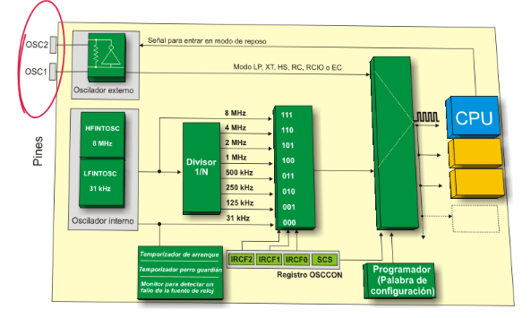
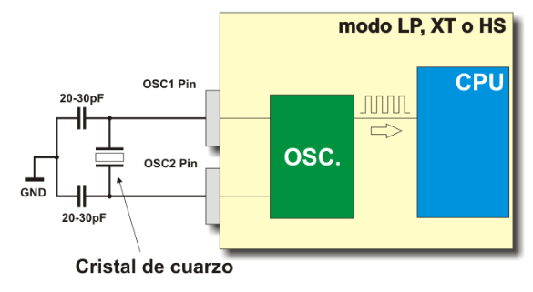
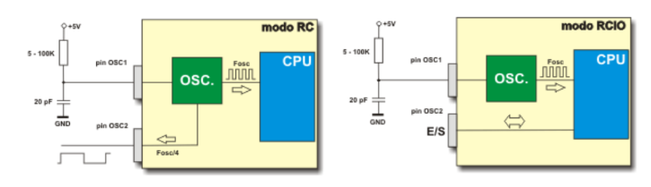
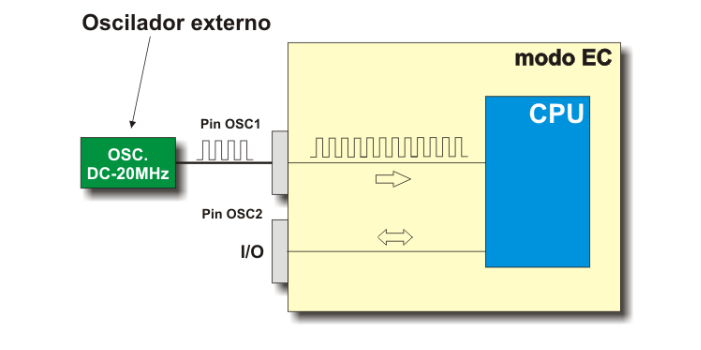
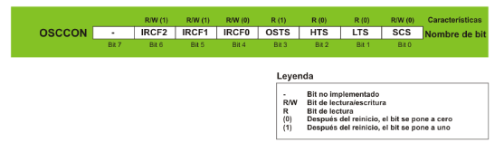
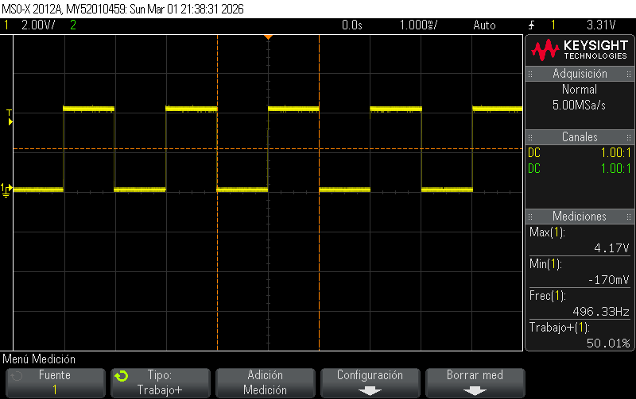
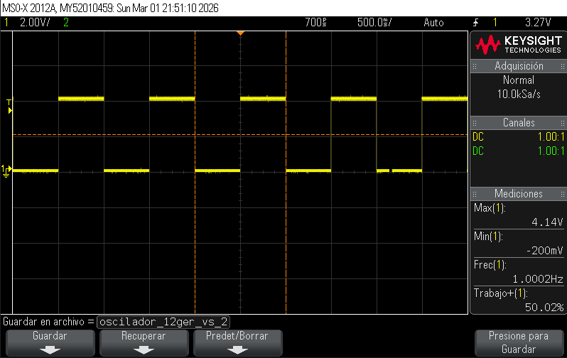
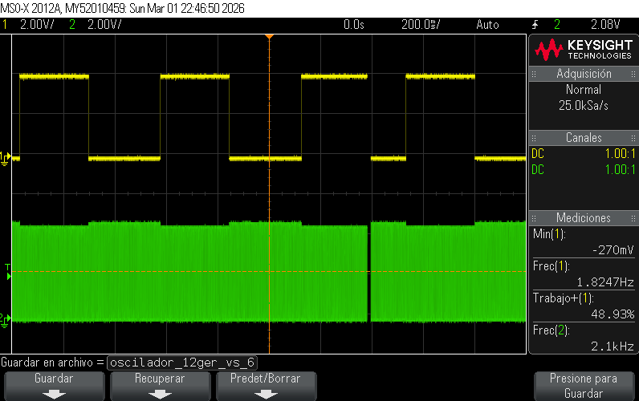
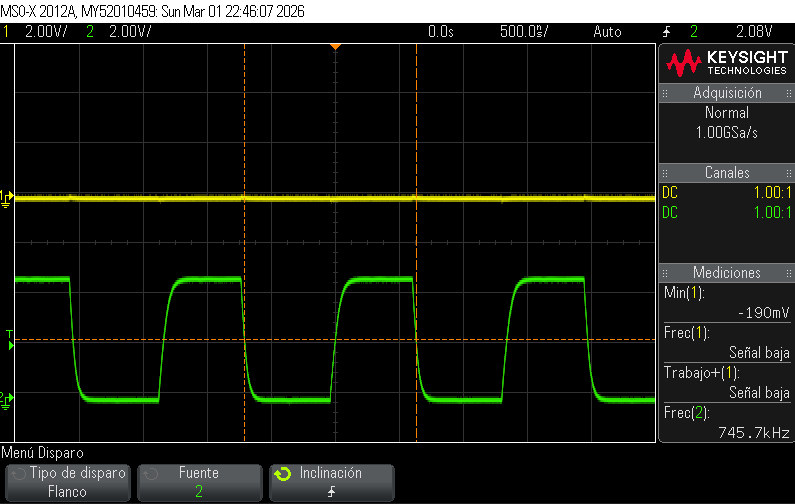

# Lab02 - Caracterización de osciladores (externo vs. interno)

## 1. Integrantes

* [Laura Alejandra Fuentes Ubaque](https://github.com/LauraAlejandraFuentes)
* [Juan Sebastian Guerrero Gualteros](https://github.com/juanseguerrerogu07)
* [Pedro Felipe Jimenez Celis](https://github.com/pedrofejimenezce-ship-it)

## 2. Documentación

En esta práctica de laboratorio se configuro el microcontrolador PIC18F45K22 para realizar el control de una salida digital. El programa, escrito en lenguaje de C y compilado con XC8 desde MPLAB, utiliza la libreria (xc.h) para detectar automaticamente que microcontrolador seleccionamos en el proyecto de MPLAB

### 2.1 Descripción del laboratorio

**OBJETIVO DE LA PRACTICA**

Configurar el PIC18F45K22 (o la referencia de PIC seleccionada) para operar con: Oscilador externo basado en cristal de cuarzo.

Oscilador interno (INTOSC). Verificar la frecuencia real de la CPU generando una señal de referencia en un pin de salida y midiendo dicha señal con un osciloscopio.

Comparar ambos modos de operación (cristal vs. INTOSC) en cuanto a:

-Precisión absoluta de la frecuencia.

-Estabilidad temporal de la señal.

-Efectos de la deriva térmica sobre la frecuencia.

**HERRAMIENTAS**

-Microcontrolador PIC18F45K22 (o la referencia de PIC seleccionada) en tarjeta de desarrollo o protoboard.

-Cristal 16 MHz (puede ser 8–20 MHz; se recomienda 16 MHz).

-2× capacitores de 21pF - 15pF.

-LED + resistencia 330Ω – 1kΩ.

-Programador (PICkit 4).

-Entorno de programación MPLAB X IDE con compilador XC8.

-Fuente de alimentación de 5V → El PICkit 4 puede suministrar tensión directamente al circuito 

-Osciloscopio.

-Protoboard y cables de conexión.

**FUNDAMENTO TEORICO**

**Oscilador:**

Un oscilador es necesario porque en casi todos los sistemas electrónicos (microcontroladores, microprocesadores, circuitos de comunicación, etc.) se requiere una señal periódica estable que sirva como referencia de tiempo o reloj. A continuación se enlistan las funciones principales de un oscilador

Sincronización
En un microcontrolador o procesador, el oscilador genera la señal de reloj que marca el “ritmo” de ejecución de las instrucciones.

Sin un reloj, el procesador no sabría cuándo avanzar de una instrucción a la siguiente.

Referencia de tiempo.

Para temporizadores, contadores, protocolos de comunicación (UART, I²C, SPI, CAN, USB, etc.), se necesita una frecuencia precisa para medir intervalos de tiempo o mantener la velocidad de transmisión correcta.

Generación de señales.

**Partes Principales del Oscilador**

**1.Oscilador externo:**

Un oscilador externo es aquel que no se encuentra integrado dentro del microcontrolador, sino que, en el caso del PIC, se conecta a los pines OSC1 y OSC2. Se denomina “externo” porque requiere componentes adicionales para generar y estabilizar la señal de reloj. Estos componentes pueden ser:

-Un cristal de cuarzo

-Un resonador cerámico

-En configuraciones más simples, un circuito RC (resistencia-capacitor).

Por lo tanto, puede funcionar en distintos modos según el cristal o circuito usado:

-LP (Low Power Crystal): cristal de baja frecuencia y bajo consumo.

-XT (Crystal/Resonator): cristal típico de 4 MHz a 10 MHz.

-HS (High-Speed Crystal): cristales de alta frecuencia (hasta decenas de MHz).

**2.Oscilador interno:**
El oscilador interno del PIC18F45K22 está compuesto por dos bloques principales:

HFINTOSC (High-Frequency Internal Oscillator): es un oscilador interno de alta frecuencia calibrado de fábrica, cuyo valor nominal es 8MHz. El microcontrolador puede trabajar directamente con esta frecuencia o con versiones reducidas mediante el divisor de prescalador.

LFINTOSC (Low-Frequency Internal Oscillator): es un oscilador interno de baja frecuencia calibrado a 
31kHz. Suele emplearse para temporizadores internos, como el Timer de encendido (Power-up Timer) y el perro guardián (Watchdog Timer), aunque también puede seleccionarse como fuente de reloj principal para todo el microcontrolador cuando se prioriza bajo consumo.

La elección entre usar un oscilador interno o externo se controla mediante el bit SCS (System Clock Select) en el registro OSCCON, el cual define cuál será la fuente activa de reloj del sistema.

**3.Divisor de frecuencia (Divisor 1/N):**
Permite reducir la frecuencia de HFINTOSC. Los valores posibles son:

8MHz → 4MHz → 2MHz → 1MHz → 500kHz → 250kHz → 125kHz → 31kHz.

La selección se hace con los bits IRCF2:IRCF0 del registro OSCCON.

**4.Registro OSCCON:**
Bits IRCF2, IRCF1, IRCF0: seleccionan la frecuencia del oscilador interno.

Bit SCS (System Clock Select): selecciona la fuente de reloj del sistema (interna o externa).

**5.CPU**
Recibe la señal de reloj seleccionada y la usa para ejecutar instrucciones.

Adicionalmente cuenta con lógica de protección (temporizador de arranque, perro guardián (watchdog), monitor de fallo de reloj) que supervisa el funcionamiento del reloj.

Estabilidad y exactitud
El oscilador interno de un microcontrolador suele ser suficiente para aplicaciones básicas, pero puede ser impreciso (deriva con la temperatura).

Por eso a veces se usa un cristal externo (ej. 16 MHz, 20 MHz) para tener una frecuencia mucho más exacta.

### 2.2 Explicación del código implementado

Los tres códigos tienen como objetivo configurar distintos tipos de osciladores en el PIC18F45K22 y generar una señal cuadrada en un pin de salida para observarla con un osciloscopio.

Cada programa utiliza una fuente de reloj diferente: oscilador interno, cristal externo y oscilador RC externo, con el fin de comparar su precisión, estabilidad y comportamiento.

La señal generada se obtiene encendiendo y apagando un pin con retardos, produciendo una frecuencia aproximada de 500 Hz

Primer codigo:

    #include <xc.h>
    #include <stdint.h> 

El xc.h permite usar los registros del microcontrolador. Y stdint.h permite usar tipos de datos como uint16_t.

    #pragma config FOSC = INTIO67

Configura el micro para usar el oscilador interno.
Los pines OSC1 y OSC2 quedan como pines digitales.

    #define _XTAL_FREQ 4000000

Indica que el microcontrolador trabaja a 4 MHz.

    __delay_ms()

Esre se utiliza para que se calculen correctamente los tiempos.

    void main(void)

Este comienza comienza la ejecución del programa.

    OSCCONbits.IRCF = 0b101;

Este registro selecciona la frecuencia del oscilador interno.
- 101 corresponde a 4MHz

    TRISBbits.TRISB0 = 1;
    TRISBbits.TRISB1 = 0;
    TRISBbits.TRISB2 = 1;
    TRISBbits.TRISB3 = 0;
    TRISBbits.TRISB4 = 1;
    TRISBbits.TRISB5 = 0;

Los registros TRIS determinan si un pin es entrada o salida, 1 representando la entrada y el 0 la salida.

    ANSELB = 0;

Este comando desactiva el modo analogico

    while(1)

Este ciclo hace que el programa se ejecute continuamente.

    if (PORTBbits.RB0 == 1)
    {
    LATBbits.LATB1 = 1;
    }
    else
    {
    LATBbits.LATB1 = 0;
    }

Este es el control de las salidas si RB0 está en alto, entonces RB1 se enciende.

    if (PORTBbits.RB2 == 1)
    {
    LATBbits.LATB3 = 1;
    }
    else
    {
    LATBbits.LATB3 = 0;
    }

RB2 controla a RB3

    if (PORTBbits.RB4 == 1)
    {
    LATBbits.LATB5 = 1;
    }
    else
    {
    LATBbits.LATB5 = 0;
    }

y RB4 contola a RB5

Del segundo Codigo, cambia la fuente de reloj del microprocesador, cambiando el oscilador interno, por el cristal externo, en este codigo se terminará de explicar lo diferente al primer codigo.

    #pragma config FOSC = HSHP

Esto indica que el micro usa un cristal externo de alta velocidad, El cristal se conecta entre los pines OSC1, OSC2, con capacitores a tierra.

    #define _XTAL_FREQ 16000000

El micro trabaja a 16 MHz porque el cristal tiene esa frecuencia, esto hace que los retardos y la ejecución del programa sean más rápidos y más precisos que con el oscilador interno.

Para el tercer codigo, aquí el micro usa un circuito RC externo para generar el reloj.

    #pragma config FOSC = RC

El reloj depende de una resistencia y un capacitor externos.

### 2.3 Análisis y comparación

#### Tabla 1: Medición en frío

| Modo de oscilador | Freq. teórica Fosc | RA6 medible (CLKO)? | Freq. medida RA6 (Hz) | Freq. teórica RC0 (Hz) | Freq. medida RC0 (Hz) | Error RC0 (%) |
|-------------------|---------------------|----------------------|------------------------|-------------------------|------------------------|---------------|
| INTOSC (interno)  | 16,000,000          | Sí                   | 500,023                | 500                     | 500.02                 | 0.004         |
| HS (cristal externo 16 MHz) | 16,000,000 | No                   | NA                     | 500                     | 500.00                 | 0.000         |
| RC externo        | ~16,000,000         | No                   | NA                     | 500                     | 498.75                 | -0.250        |

**Análisis Tabla 1:** En condiciones de frío, el oscilador con cristal externo (HS) presenta la mayor precisión con 0% de error. El oscilador interno INTOSC muestra una desviación mínima de +0.004%, mientras que el RC externo tiene un error del -0.25%, indicando que su frecuencia real está por debajo de la teórica.

---

#### Tabla 2: Medición con calor

| Modo de oscilador | Freq. teórica Fosc | RA6 medible (CLKO)? | Freq. medida RA6 (Hz) | Freq. teórica RC0 (Hz) | Freq. medida RC0 (Hz) | Error RC0 (%) |
|-------------------|---------------------|----------------------|------------------------|-------------------------|------------------------|---------------|
| INTOSC (interno)  | 16,000,000          | Sí                   | 498,456                | 500                     | 498.46                 | -0.308        |
| HS (cristal externo 16 MHz) | 16,000,000 | No                   | NA                     | 500                     | 499.99                 | -0.002        |
| RC externo        | ~16,000,000         | No                   | NA                     | 500                     | 495.20                 | -0.960        |

**Análisis Tabla 2:** Al aplicar calor, todos los osciladores presentan una disminución en la frecuencia. El INTOSC se desvía -0.308%, el HS mantiene una excelente estabilidad con solo -0.002% de error, mientras que el RC externo es el más afectado con un error de -0.96%, demostrando alta sensibilidad térmica.

---

#### Tabla 3: Deriva

| Modo de oscilador | RC0 deriva (Hz) |
|-------------------|------------------|
| INTOSC (interno)  | -1.56            |
| HS (cristal externo 16 MHz) | -0.01 |
| RC externo        | -3.55            |

**Análisis Tabla 3:** La deriva térmica (diferencia entre frío y calor) confirma que el cristal externo HS es el más estable con solo -0.01 Hz de variación. El INTOSC presenta una deriva moderada de -1.56 Hz, mientras que el RC externo es el más inestable con -3.55 Hz de desviación.

---

#### Tabla 4: Medición en frío con PLL (x4)

| Modo de oscilador | Freq. teórica Fosc | Freq. con PLL | RA6 medible (CLKO)? | Freq. medida RA6 (Hz) | Freq. teórica RC0 (Hz) | Freq. medida RC0 (Hz) | Error RC0 (%) |
|-------------------|---------------------|---------------|----------------------|------------------------|-------------------------|------------------------|---------------|
| INTOSC (interno)  | 16,000,000          | 64,000,000    | Sí                   | 2,000,092              | 500                     | 500.09                 | 0.018         |
| HS (cristal externo 16 MHz) | 16,000,000 | 64,000,000    | No                   | NA                     | 500                     | 500.00                 | 0.000         |
| RC externo        | ~16,000,000         | ~64,000,000   | No                   | NA                     | 500                     | 498.70                 | -0.260        |

**Análisis Tabla 4:** Con PLL activado en frío, los errores se multiplican proporcionalmente. El INTOSC aumenta su error a +0.018%, el HS se mantiene perfecto, y el RC externo se mantiene en -0.26%, similar a su comportamiento sin PLL.

---

#### Tabla 5: Medición con calor y PLL (x4)

| Modo de oscilador | Freq. teórica Fosc | Freq. con PLL | RA6 medible (CLKO)? | Freq. medida RA6 (Hz) | Freq. teórica RC0 (Hz) | Freq. medida RC0 (Hz) | Error RC0 (%) |
|-------------------|---------------------|---------------|----------------------|------------------------|-------------------------|------------------------|---------------|
| INTOSC (interno)  | 16,000,000          | 64,000,000    | Sí                   | 1,993,824              | 500                     | 498.46                 | -0.308        |
| HS (cristal externo 16 MHz) | 16,000,000 | 64,000,000    | No                   | NA                     | 500                     | 499.98                 | -0.004        |
| RC externo        | ~16,000,000         | ~64,000,000   | No                   | NA                     | 500                     | 494.85                 | -1.030        |

**Análisis Tabla 5:** Con calor y PLL, el patrón se mantiene pero los errores se amplifican. El INTOSC mantiene -0.308%, el HS es casi perfecto con -0.004%, y el RC externo empeora a -1.03%, siendo el menos recomendable para aplicaciones de precisión en condiciones variables.

---

#### Tabla 6: Deriva con PLL

| Modo de oscilador | RC0 deriva con PLL (Hz) |
|-------------------|--------------------------|
| INTOSC (interno)  | -1.63                     |
| HS (cristal externo 16 MHz) | -0.02        |
| RC externo        | -3.85                      |

**Análisis Tabla 6:** La deriva con PLL confirma la tendencia: el HS es ultra estable (-0.02 Hz), el INTOSC tiene deriva moderada (-1.63 Hz) y el RC externo es muy inestable (-3.85 Hz). El PLL amplifica ligeramente las derivas existentes.

---

### Análisis General

| Oscilador | Precisión en frío | Estabilidad térmica | Efecto del PLL | Recomendación |
|-----------|-------------------|---------------------|----------------|----------------|
| INTOSC (interno) | Buena (0.004%) | Moderada (-1.56 Hz) | Amplificación proporcional | Aplicaciones generales |
| HS (cristal externo) | Excelente (0%) | Excelente (-0.01 Hz) | Mínimo | Aplicaciones críticas |
| RC externo | Regular (-0.25%) | Mala (-3.55 Hz) | Amplificación significativa | Solo si no hay alternativa |

**Conclusión:** El oscilador con cristal externo HS es claramente superior para aplicaciones que requieren precisión y estabilidad. El INTOSC ofrece un buen equilibrio para uso general. El RC externo solo debería usarse en aplicaciones no críticas y con temperatura controlada.

## 2.4 Diagramas

Fig 1.Arquitectura de selección del reloj [1]

Fig 2.Oscilador externo (modos LP,XT y HS)[1]

Fig 3.Oscilador externo modo RC [1]

Fig 4. Señal externa

Fig 5. Registro OSCCON [1]

## 2.5 Formas de onda

### INTOSC (interno) 

### HS

## RC

## 3. Evidencias de implementación
* [Video lab1](https://youtu.be/1uqVIVOrfaQ)
* [Video lab2](https://youtu.be/LPDfCZH4naY)
* [Video lab3](https://youtu.be/ne4GAs_R6sE)
* [Video Simulacion](https://youtu.be/C1sOraezwtQ)
## 4. Preguntas

* ¿En qué modo se obtuvo la medición más cercana a la frecuencia teórica?

El modo en el que se obtuvo la medición mas cercana a la frecuencia teorica fue en el modo HS (Cristal externo de 16MHz) en este modo obtuvimos una medición de una frecuencia de 500Hz y dentro de la teoria tambien nos dio el mismo valor de frecuencia.

* ¿Fue posible evidenciar el fenómeno de deriva? ¿Qué factores podrían explicar la variación de frecuencia al calentar el PIC?

Si se evidencio el fenomeno de deriva. El modo RC externo fue el que mostró la mayor deriva con una variación de -3.55 Hz entre el frio y el calor, mientras que el mas estable fue Cristal externo de 16MHz.

La variacion se debe a que el calor afecta las propiedades fisicas de los materiales. En el caso del oscilador interno y el RC, la temperatura altera la resistencia y la capacitancia de los nodos, cambiando el tiempo de carga y descarga que es lo que define la frecuencia. Dentro del cristal es mas estable, debido a que el calor afecta muy poco la vibracion del cuarzo.

* ¿Cuál es más preciso en cuanto a frecuencia teórica vs. medida?

De las 3 configuraciones hechas con los osciladores el que menos error tiene o el mas preciso en este caso seria el Cristal de cuarzo de 16MHz, su porcentaje de rror es muy bajo, el que le sigue es el Oscilador interno del PIC tiene un poco de error comparado al Cristal de cuarzo y el ultimo es el Oscilador por un sistema RC,que tiene un error mucho más grande que el resto de los osciladores.

* Explique cómo usar RC0 para estimar la frecuencia del oscilador cuando RA6 no está disponible.

Para utilizar el RC0 para estimar la frecuencia del osiclador cuando RA6 no esta disponible, se crea una señal en RC0 mediante el software. El PIC en este caso ejecuta instrucciones a una velocidad definida por una Frecuencia de instruccion que es igual a la Frecuencia del Oscilador sobre 4. Para tener en cuenta la frecuencia real del oscilador, usando la medida del RC0, nuestro codigo esta configurado a una frecuencia de 16MHz, lo que se espera que ell compilador ejecute las intrucciones a 4MHz. Con esto el código genera una señal en RC0 de 500Hz teoricos.

Si medimos la frecuencia real en el pin RC0 con el osciloscopio, cualquier variacion que haya respeceto a los 500Hz teoricos nos va a permitir calcular la frecuencia real del oscilador. Esto se debe a que el tiempo de procesamiento tarda en ejecutar el ciclo del pin que depende completamente de la velocidad del reloj principal.

* Si se quisiera duplicar la frecuencia del PIC usando PLL, ¿en qué modos se podría aplicar?

En los modos que se podria aplicar el PLL seria en los modos: Modo HS y Modo del Oscilador interno.

En el modo del HS la frecuencia del Cristal de cuarzo que se esta usando deberia estar entre 4MHz y 16MHz ya que el PLL elevaria la frecuencia de 16MHz a 64MHz, que es el limite de el PIC18F45K22

En el modo de Oscilador interno, se puede aplicar el PLL ya que si seleccionamos una frecuencia interna de 16MHz y activamos el PLL, el microcontrolador correra a 64MHz. Para hacer el cambio de la oscilacion interna se hace mediante los bits y la configuracion del registro OSCTUNE dentro de la programación.

* Enliste ventajas y desventajas de cada modo.

**Ventajas Oscilador Interno**

En este caso una de las ventajas que tiene el Oscilador Interno es que no se necesitan componentes externos, ademas de la liberacion de pines y que tiene una muy buena precision

**Desventajas Oscilador Interno**

Una de las desventajas del Oscilador Interno es la deriva que tiene, su estabilidad termica es moderada y su deriva es de -1.56Hz con calor

**Ventajas HS (Cristal de cuarzo)**

Tiene una gran precision además de una muy buena estabilidad termica muy buena, es muy buena opcion para aplicaciones que requieren mucha precision

**Desventajas HS (Cristal de cuarzo)**

Una de las desventajas de este modo es que requiere un Cristal de cuarzo y capacitores externos que ocupan dos pines del PIC

**Ventajas RC Externo**

Una de las ventajas de este modo es su facilidad ademas de que su accesibilidad es muy fácil

**Desventajas RC Externo**

Las desventajas que tiene este modo es que es muy impreciso teniendo un buen porcentaje de error, su sensibilidad al calor es muy alta que conlleva a una mayor deriva termica (-3.55Hz), además de la ocupacion de pines que lleva esta configuracion.

## 5. Referencias